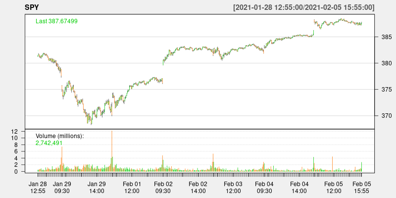

## td: R Access to twelvedata

[](https://github.com/eddelbuettel/td/actions?query=workflow%3Aci)
[](https://www.gnu.org/licenses/gpl-2.0.html)
[](https://github.com/eddelbuettel/td)

### Motivation

[twelvedata](https://www.twelvedata.com) provides a very rich REST API, see
the [documentation](https://www.twelvedata.com/docs).  While a (free) login
and a (free, permitting limited but possibly sufficient use) API key are
required, the provided access is rich to set up simple R routines.  This
package does that.

### Example

Running the code from `example(time_series)` 

```r
> library(td)
> data <- time_series("SPY", "5min", 500, "xts")
> if (requireNamespace("quantmod", quietly=TRUE)) {
>     suppressMessages(library(quantmod))   # suppress some noise
>     chartSeries(data, attr(data, "symbol"), theme="white")  # convenient plot for OHLCV
> }
```

retrieves an `xts` object (provided [xts](https://cran.r-project.org/package=xts) is installed) 
and produces a chart like this:



### Status

Right now the package is brand new and reasonably empty. 

### Contributing

Any problems, bug reports, or features requests for the package can be submitted and handled most
conveniently as [Github issues](https://github.com/eddelbuettel/td/issues) in the repository.

Before submitting pull requests, it is frequently preferable to first discuss need and scope in such
an issue ticket.  See the file
[Contributing.md](https://github.com/RcppCore/Rcpp/blob/master/Contributing.md) (in the
[Rcpp](https://github.com/RcppCore/Rcpp) repo) for a brief discussion.

### Author

Dirk Eddelbuettel

### License

GPL (>= 2)

