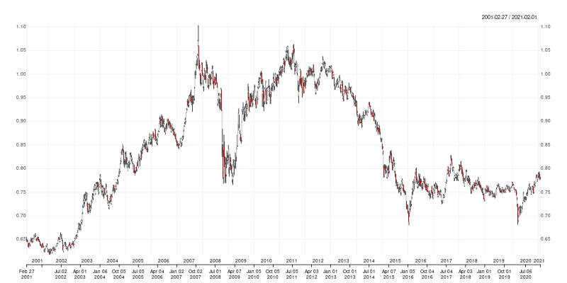

## td: R Access to twelvedata

[](https://github.com/eddelbuettel/td/actions?query=workflow%3Aci)
[](https://www.gnu.org/licenses/gpl-2.0.html)
[](https://github.com/eddelbuettel/td)

### Motivation

[twelvedata](https://www.twelvedata.com) provides a very rich REST API, see
the [documentation](https://www.twelvedata.com/docs).  While a (free) login
and a (free, permitting limited but possibly sufficient use) API key are
required, the provided access is rich to set up simple R routines.  This
package does that.

### Example

Running the code from `example(time_series)` 

```r
> library(td)
> data <- time_series("SPY", "5min", 500, "xts")
> if (requireNamespace("quantmod", quietly=TRUE)) {
>     suppressMessages(library(quantmod))   # suppress some noise
>     chartSeries(data, name=attr(data, "symbol"), theme="white")  # convenient plot for OHLCV
> }
```

retrieves an `xts` object (provided [xts](https://cran.r-project.org/package=xts) is installed) 
and produces a chart like this:


The package can also be used without attaching it. The next example retrieves twenty years of weekly
CAD/USD foreign exchange data using a direct `td::time_series()` call with having the package
loaded.  The API key is automagically set (if it is in fact provided either in the user config file
or as an environment variable).  Also shown by calling `str()` on the return object is the metadata
attach after each request:

```r
> cadusd <- td::time_series(sym="CAD/USD", interval="1week", outputsize=52.25*20, as="xts")
> str(cadusd)
An ‘xts’ object on 2001-02-27/2021-02-01 containing:
  Data: num [1:1045, 1:4] 0.651 0.646 0.644 0.638 0.642 ...
 - attr(*, "dimnames")=List of 2
  ..$ : NULL
  ..$ : chr [1:4] "open" "high" "low" "close"
  Indexed by objects of class: [Date] TZ: UTC
  xts Attributes:  
List of 6
 $ symbol        : chr "CAD/USD"
 $ interval      : chr "1week"
 $ currency_base : chr "Canadian Dollar"
 $ currency_quote: chr "US Dollar"
 $ type          : chr "Physical Currency"
 $ accessed      : chr "2021-02-06 15:16:29.209635"
> 
```

As before, it can be plotted using a function from package
[quantmod](https://cran.r-project.org/package=quantmod); this time we use the newer
`chart_Series()`:

```r
> quantmod::chart_Series(cadusd, name=attr(data, "symbol"))
```



### Status

Right now the package is brand new and reasonably empty. 

### Contributing

Any problems, bug reports, or features requests for the package can be submitted and handled most
conveniently as [Github issues](https://github.com/eddelbuettel/td/issues) in the repository.

Before submitting pull requests, it is frequently preferable to first discuss need and scope in such
an issue ticket.  See the file
[Contributing.md](https://github.com/RcppCore/Rcpp/blob/master/Contributing.md) (in the
[Rcpp](https://github.com/RcppCore/Rcpp) repo) for a brief discussion.

### Author

Dirk Eddelbuettel

### License

GPL (>= 2)

