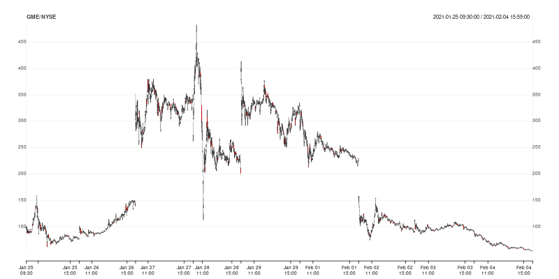
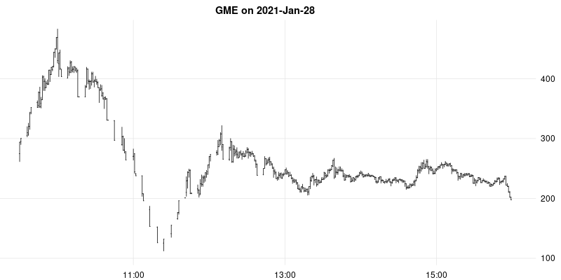

## td: R Access to twelvedata

[](https://github.com/eddelbuettel/td/actions?query=workflow%3Aci)
[](https://www.gnu.org/licenses/gpl-2.0.html)
[](https://github.com/eddelbuettel/td)

### Motivation

[twelvedata](https://www.twelvedata.com) provides a very rich REST API, see
the [documentation](https://www.twelvedata.com/docs).  While a (free) login
and a (free, permitting limited but possibly sufficient use) API key are
required, the provided access is rich to set up simple R routines.  This
package does that.

### Example

Here we are running (some) code from shown in `example(time_series)` 

```r
> library(td)
> data <- time_series("SPY", "5min", outputsize=500, as="xts")
> if (requireNamespace("quantmod", quietly=TRUE)) {
>     suppressMessages(library(quantmod))   # suppress some noise
>     chartSeries(data, name=attr(data, "symbol"), theme="white")  # convenient plot for OHLCV
> }
```

retrieves an `xts` object (provided [xts](https://cran.r-project.org/package=xts) is installed) 
and produces a chart like this:


The package can also be used without attaching it. The next example retrieves twenty years of weekly
CAD/USD foreign exchange data using a direct `td::time_series()` call with having the package
loaded.  The API key is automagically set (if it is in fact provided either in the user config file
or as an environment variable).  Also shown by calling `str()` on the return object is the metadata
attach after each request:

```r
> cadusd <- td::time_series(sym="CAD/USD", interval="1week", outputsize=52.25*20, as="xts")
> str(cadusd)
An ‘xts’ object on 2001-02-27/2021-02-01 containing:
  Data: num [1:1045, 1:4] 0.651 0.646 0.644 0.638 0.642 ...
 - attr(*, "dimnames")=List of 2
  ..$ : NULL
  ..$ : chr [1:4] "open" "high" "low" "close"
  Indexed by objects of class: [Date] TZ: UTC
  xts Attributes:  
List of 6
 $ symbol        : chr "CAD/USD"
 $ interval      : chr "1week"
 $ currency_base : chr "Canadian Dollar"
 $ currency_quote: chr "US Dollar"
 $ type          : chr "Physical Currency"
 $ accessed      : chr "2021-02-06 15:16:29.209635"
> 
```

As before, it can be plotted using a function from package
[quantmod](https://cran.r-project.org/package=quantmod); this time we use the newer
`chart_Series()`:

```r
> quantmod::chart_Series(cadusd, name=attr(data, "symbol"))
```


As the returned is a the very common and well-understood [xts] format, many other plotting functions
can be used as-is. Here is an example also showing how historical data can be accessed.  We retrieve
minute-resolution data for `GME` during the late January / early February period:

```r
> gme <- time_series("GME", "1min",
+                    start_date="2021-01-25 09:30:00",
+                    end_date="2021-02-04 16:00:00", as="xts")
```

Note the use of exchange timestamps (NYSE is open from 9:30 to 16:00 local time).

We can plot this again using `quantmod::chart_Series()` showing how to display ticker symbol
and exchange as a header:

```r
> quantmod::chart_Series(gme, name=paste0(attr(gme, "symbol"), "/", attr(gme, "exchange")))
```



Naturally, other plotting functions and packages can be used. Here we use the _same dataset but
efficiently subset_ using a key `xts` feature and fed into CRAN package
[rtsplot](https://rtsvizteam.bitbucket.io/pkg/rtsplot/#/) and requesting OHLC instead of line plot.

```r
> rtsplot::rtsplot(gme["20210128"], main="GME on 2021-Jan-28", type="ohlc")
```




### Status

Still fairly new and fresh.

We also note that the package is not affiliated with [twelvedata](https://www.twelvedata.com). For
an officially supported package, see their
[twelvedata-python](https://github.com/twelvedata/twelvedata-python) package.

### Contributing

Any problems, bug reports, or features requests for the package can be submitted and handled most
conveniently as [Github issues](https://github.com/eddelbuettel/td/issues) in the repository.

Before submitting pull requests, it is frequently preferable to first discuss need and scope in such
an issue ticket.  See the file
[Contributing.md](https://github.com/RcppCore/Rcpp/blob/master/Contributing.md) (in the
[Rcpp](https://github.com/RcppCore/Rcpp) repo) for a brief discussion.

### Author

Dirk Eddelbuettel

### License

GPL (>= 2)

